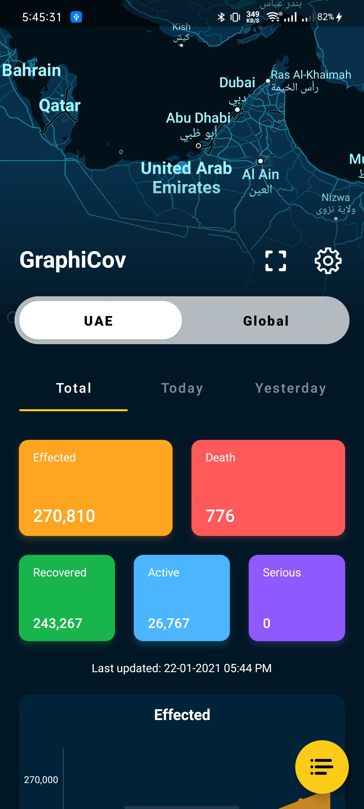
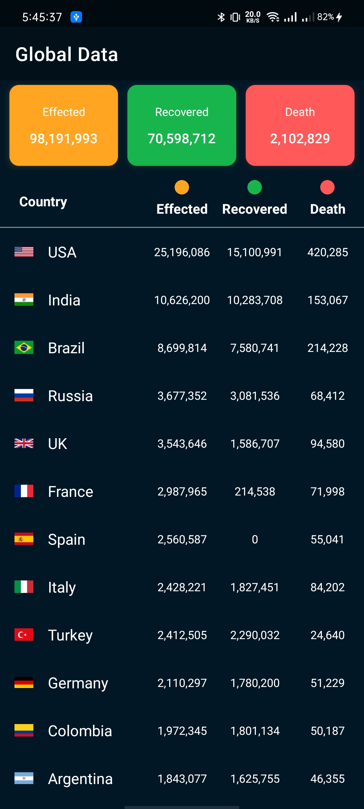
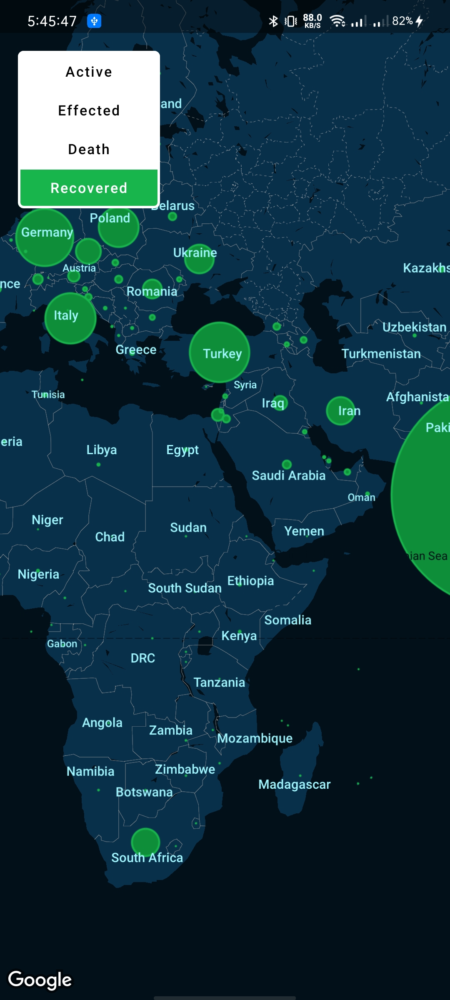
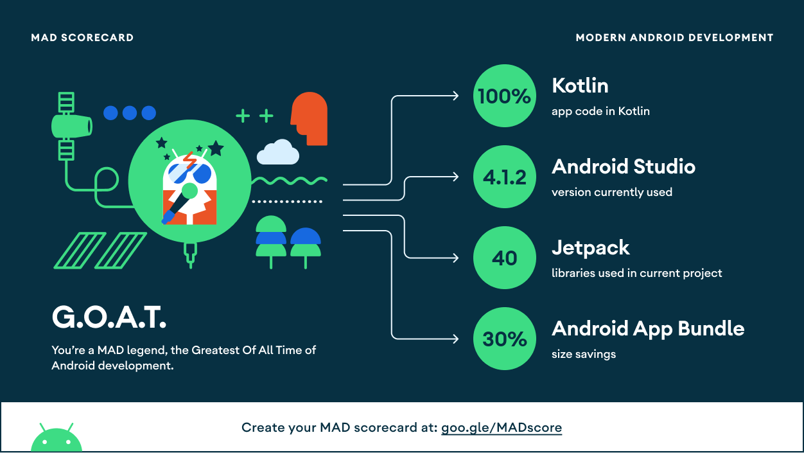
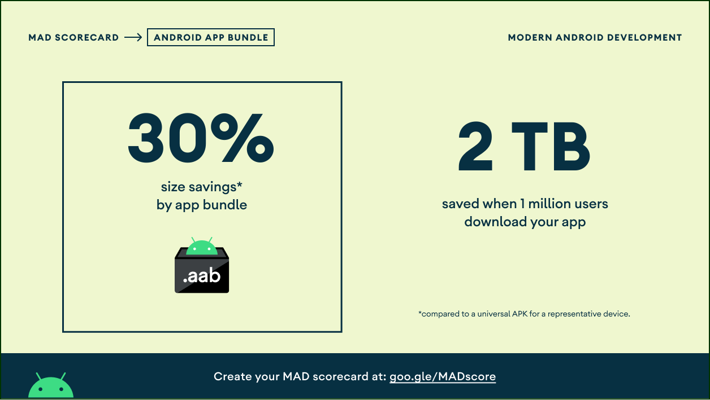

# Graphicov
### A covid statistics Android application implemented using Koltin and MVVM Architecture

This application will provide daily and total covid 19 statistics globaly and for each countries.

Dashboard          |  Global Data        |  Map Data
:-----------------:|:-------------------:|:-------------------:
</img>|</img>|</img>

  
### Play Store

  

### Data Source

  

### MAD Scorecard  
<a href="https://madscorecard.withgoogle.com/scorecards/2942804448/" target="_blank">
</img> 
</img>
</img>
</img>
</a>
